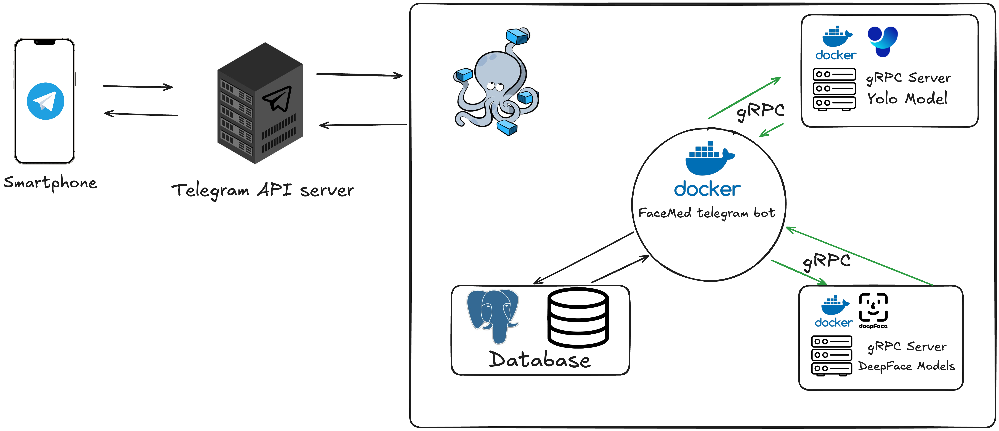
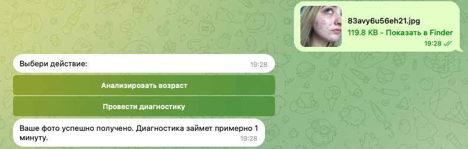

# Coursework 2024-2025 HSE | FaceMed
Telegram bot for conducting an express diagnosis of a person’s state according to a person


---
# Architecture

# 👨‍⚕️ Analysis of diseases pipeline

1. Sending photos Telegram bot and choice of action "Conduct" Diagnosis"

2. Detect disease with YOLOv11 [(YOLO)](https://docs.ultralytics.com/ru/models/yolo11/)
Photos are sent to the gRPC server where it processes the YOLOv11 model 
3. Obtaining a marked photo


---

# Datasets and models
At the moment, the bot can distinguish 4 classes 
- acne (acne)
- exophthalmos (Bazedova disease)
- goiter (Bazedova disease)
- yellowed eyes (varieties of hepatitis)

At the time of the work, these diseases were selected, since there was an opinion that these diseases are characterized by related sign, and they are easiest to find. Further work pre -regulates the expansion of classes, an increase, and the balancing of the dataset, and the improvement of the quality of models.

Datasets for training\
[Dataset](https://www.kaggle.com/datasets/leagueofsilvers/disease-of-face)

---

## Install
Clone the repository 
```bash
git clone https://github.com/Zuganin/FaceMed.git
cd FaceMed
```
2. Downland model "detect_acne.pt" and "detect_disease" https://disk.yandex.ru/d/Snr4azlMXkMaqQ

3. Move file .pt to folder FaceMed (in manual or using bash) \\
```bash
mv ~/YOUR_PATH/MODEL.pt ~/YOUR_PATH/FaceMed/detect_disease/models
```
4. Create vitrual environment and install requirements (optional)
```bash
python3 -m venv venv
source venv/bin/activate
pip install -r requirements.txt
 ``` 
5. Run docker-compose
```bash
POSTGRES_PASSWORD=PASSWORD docker-compose up -d
```
6. Run Telegram and search @FaceMedBot [FaceMedBot](https://t.me/FaceMedBot). It`s all.